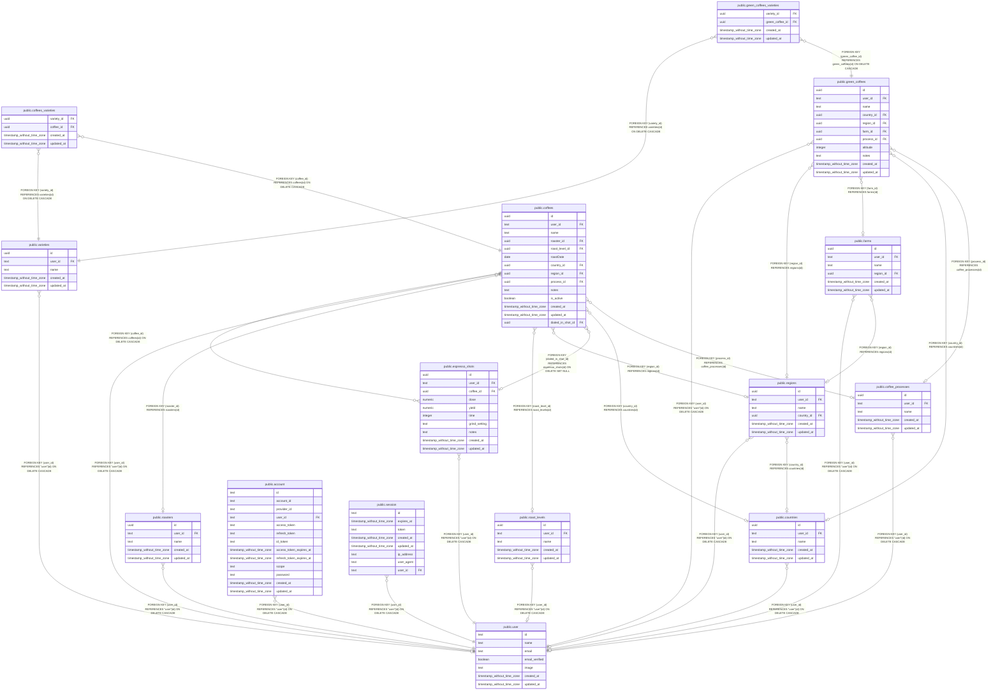

# railway

## Tables

| Name | Columns | Comment | Type |
| ---- | ------- | ------- | ---- |
| [public.coffee_processes](public.coffee_processes.md) | 5 |  | BASE TABLE |
| [public.coffees](public.coffees.md) | 14 |  | BASE TABLE |
| [public.coffees_varieties](public.coffees_varieties.md) | 4 |  | BASE TABLE |
| [public.countries](public.countries.md) | 5 |  | BASE TABLE |
| [public.espresso_shots](public.espresso_shots.md) | 10 |  | BASE TABLE |
| [public.farms](public.farms.md) | 6 |  | BASE TABLE |
| [public.green_coffees](public.green_coffees.md) | 11 |  | BASE TABLE |
| [public.green_coffees_varieties](public.green_coffees_varieties.md) | 4 |  | BASE TABLE |
| [public.regions](public.regions.md) | 6 |  | BASE TABLE |
| [public.roast_levels](public.roast_levels.md) | 5 |  | BASE TABLE |
| [public.roasters](public.roasters.md) | 5 |  | BASE TABLE |
| [public.varieties](public.varieties.md) | 5 |  | BASE TABLE |
| [public.account](public.account.md) | 13 |  | BASE TABLE |
| [public.session](public.session.md) | 8 |  | BASE TABLE |
| [public.user](public.user.md) | 7 |  | BASE TABLE |

## Relations

---

> Generated by [tbls](https://github.com/k1LoW/tbls)
