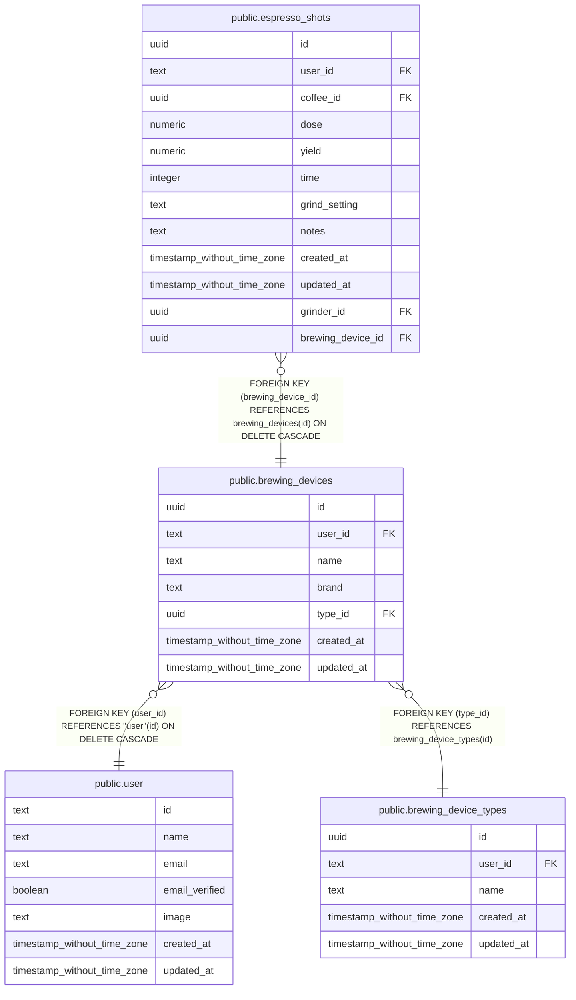

# public.brewing_devices

## Columns

| Name | Type | Default | Nullable | Children | Parents | Comment |
| ---- | ---- | ------- | -------- | -------- | ------- | ------- |
| id | uuid | gen_random_uuid() | false | [public.espresso_shots](public.espresso_shots.md) |  |  |
| user_id | text |  | false |  | [public.user](public.user.md) |  |
| name | text |  | false |  |  |  |
| brand | text |  | false |  |  |  |
| type_id | uuid |  | false |  | [public.brewing_device_types](public.brewing_device_types.md) |  |
| created_at | timestamp without time zone | now() | false |  |  |  |
| updated_at | timestamp without time zone |  | true |  |  |  |

## Constraints

| Name | Type | Definition |
| ---- | ---- | ---------- |
| brewing_devices_user_id_user_id_fkey | FOREIGN KEY | FOREIGN KEY (user_id) REFERENCES "user"(id) ON DELETE CASCADE |
| brewing_devices_type_id_brewing_device_types_id_fkey | FOREIGN KEY | FOREIGN KEY (type_id) REFERENCES brewing_device_types(id) |
| brewing_devices_pkey | PRIMARY KEY | PRIMARY KEY (id) |

## Indexes

| Name | Definition |
| ---- | ---------- |
| brewing_devices_pkey | CREATE UNIQUE INDEX brewing_devices_pkey ON public.brewing_devices USING btree (id) |
| brewing_devices_user_id_index | CREATE INDEX brewing_devices_user_id_index ON public.brewing_devices USING btree (user_id) |
| brewing_devices_name_user_id_index | CREATE UNIQUE INDEX brewing_devices_name_user_id_index ON public.brewing_devices USING btree (name, user_id) |

## Relations

---

> Generated by [tbls](https://github.com/k1LoW/tbls)
