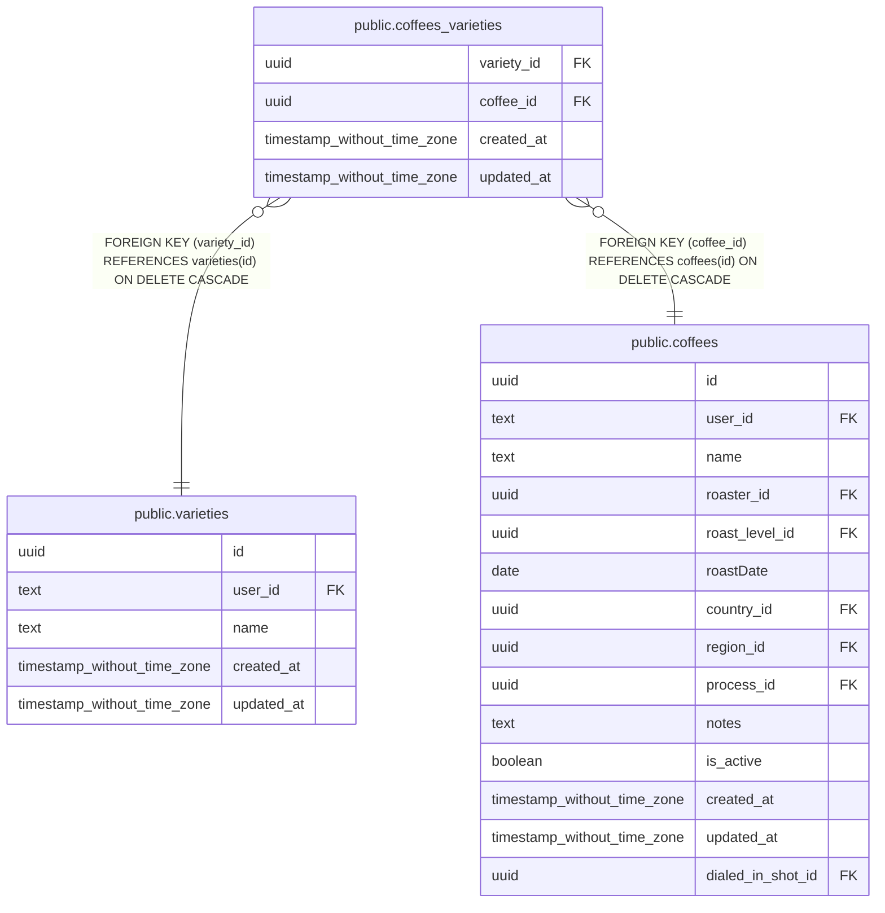

# public.coffees_varieties

## Columns

| Name | Type | Default | Nullable | Children | Parents | Comment |
| ---- | ---- | ------- | -------- | -------- | ------- | ------- |
| variety_id | uuid |  | false |  | [public.varieties](public.varieties.md) |  |
| coffee_id | uuid |  | false |  | [public.coffees](public.coffees.md) |  |
| created_at | timestamp without time zone | now() | false |  |  |  |
| updated_at | timestamp without time zone |  | true |  |  |  |

## Constraints

| Name | Type | Definition |
| ---- | ---- | ---------- |
| coffees_varieties_coffee_id_coffees_id_fkey | FOREIGN KEY | FOREIGN KEY (coffee_id) REFERENCES coffees(id) ON DELETE CASCADE |
| coffees_varieties_pkey | PRIMARY KEY | PRIMARY KEY (coffee_id, variety_id) |
| coffees_varieties_variety_id_varieties_id_fkey | FOREIGN KEY | FOREIGN KEY (variety_id) REFERENCES varieties(id) ON DELETE CASCADE |

## Indexes

| Name | Definition |
| ---- | ---------- |
| coffees_varieties_pkey | CREATE UNIQUE INDEX coffees_varieties_pkey ON public.coffees_varieties USING btree (coffee_id, variety_id) |

## Relations

---

> Generated by [tbls](https://github.com/k1LoW/tbls)
