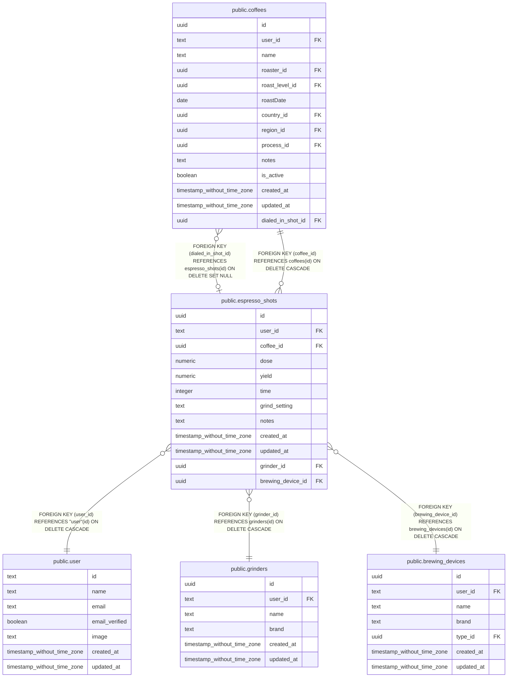

# public.espresso_shots

## Columns

| Name | Type | Default | Nullable | Children | Parents | Comment |
| ---- | ---- | ------- | -------- | -------- | ------- | ------- |
| id | uuid | gen_random_uuid() | false | [public.coffees](public.coffees.md) |  |  |
| user_id | text |  | false |  | [public.user](public.user.md) |  |
| coffee_id | uuid |  | false |  | [public.coffees](public.coffees.md) |  |
| dose | numeric |  | true |  |  |  |
| yield | numeric |  | true |  |  |  |
| time | integer |  | true |  |  |  |
| grind_setting | text |  | true |  |  |  |
| notes | text |  | true |  |  |  |
| created_at | timestamp without time zone | now() | false |  |  |  |
| updated_at | timestamp without time zone |  | true |  |  |  |
| grinder_id | uuid |  | false |  | [public.grinders](public.grinders.md) |  |
| brewing_device_id | uuid |  | false |  | [public.brewing_devices](public.brewing_devices.md) |  |

## Constraints

| Name | Type | Definition |
| ---- | ---- | ---------- |
| espresso_shots_coffee_id_coffees_id_fkey | FOREIGN KEY | FOREIGN KEY (coffee_id) REFERENCES coffees(id) ON DELETE CASCADE |
| espresso_shots_pkey | PRIMARY KEY | PRIMARY KEY (id) |
| espresso_shots_user_id_user_id_fkey | FOREIGN KEY | FOREIGN KEY (user_id) REFERENCES "user"(id) ON DELETE CASCADE |
| espresso_shots_grinder_id_grinders_id_fkey | FOREIGN KEY | FOREIGN KEY (grinder_id) REFERENCES grinders(id) ON DELETE CASCADE |
| espresso_shots_brewing_device_id_brewing_devices_id_fkey | FOREIGN KEY | FOREIGN KEY (brewing_device_id) REFERENCES brewing_devices(id) ON DELETE CASCADE |

## Indexes

| Name | Definition |
| ---- | ---------- |
| espresso_shots_pkey | CREATE UNIQUE INDEX espresso_shots_pkey ON public.espresso_shots USING btree (id) |
| espresso_shots_user_idx | CREATE INDEX espresso_shots_user_idx ON public.espresso_shots USING btree (user_id) |
| espresso_shots_user_coffee_idx | CREATE INDEX espresso_shots_user_coffee_idx ON public.espresso_shots USING btree (user_id, coffee_id) |

## Relations

---

> Generated by [tbls](https://github.com/k1LoW/tbls)
