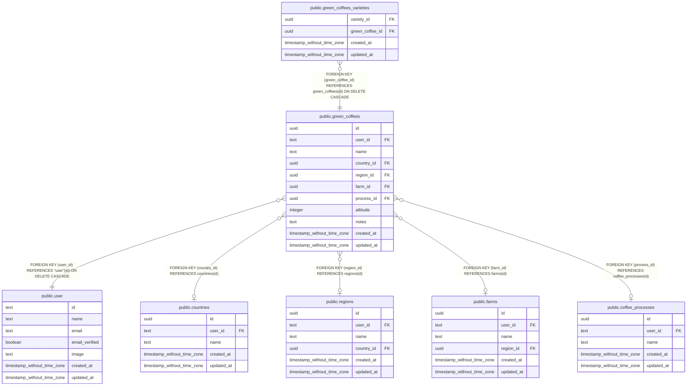

# public.green_coffees

## Columns

| Name | Type | Default | Nullable | Children | Parents | Comment |
| ---- | ---- | ------- | -------- | -------- | ------- | ------- |
| id | uuid | gen_random_uuid() | false | [public.green_coffees_varieties](public.green_coffees_varieties.md) |  |  |
| user_id | text |  | false |  | [public.user](public.user.md) |  |
| name | text |  | false |  |  |  |
| country_id | uuid |  | true |  | [public.countries](public.countries.md) |  |
| region_id | uuid |  | true |  | [public.regions](public.regions.md) |  |
| farm_id | uuid |  | true |  | [public.farms](public.farms.md) |  |
| process_id | uuid |  | true |  | [public.coffee_processes](public.coffee_processes.md) |  |
| altitude | integer |  | true |  |  |  |
| notes | text |  | true |  |  |  |
| created_at | timestamp without time zone | now() | false |  |  |  |
| updated_at | timestamp without time zone |  | true |  |  |  |

## Constraints

| Name | Type | Definition |
| ---- | ---- | ---------- |
| green_coffees_process_id_coffee_processes_id_fkey | FOREIGN KEY | FOREIGN KEY (process_id) REFERENCES coffee_processes(id) |
| green_coffees_country_id_countries_id_fkey | FOREIGN KEY | FOREIGN KEY (country_id) REFERENCES countries(id) |
| green_coffees_farm_id_farms_id_fkey | FOREIGN KEY | FOREIGN KEY (farm_id) REFERENCES farms(id) |
| green_coffees_pkey | PRIMARY KEY | PRIMARY KEY (id) |
| green_coffees_region_id_regions_id_fkey | FOREIGN KEY | FOREIGN KEY (region_id) REFERENCES regions(id) |
| green_coffees_user_id_user_id_fkey | FOREIGN KEY | FOREIGN KEY (user_id) REFERENCES "user"(id) ON DELETE CASCADE |

## Indexes

| Name | Definition |
| ---- | ---------- |
| green_coffees_pkey | CREATE UNIQUE INDEX green_coffees_pkey ON public.green_coffees USING btree (id) |
| green_coffees_user_idx | CREATE INDEX green_coffees_user_idx ON public.green_coffees USING btree (user_id) |
| green_coffees_user_name_idx | CREATE UNIQUE INDEX green_coffees_user_name_idx ON public.green_coffees USING btree (name, user_id) |
| green_coffees_user_process_id_idx | CREATE INDEX green_coffees_user_process_id_idx ON public.green_coffees USING btree (process_id, user_id) |
| green_coffees_user_country_idx | CREATE INDEX green_coffees_user_country_idx ON public.green_coffees USING btree (country_id, user_id) |

## Relations

---

> Generated by [tbls](https://github.com/k1LoW/tbls)
