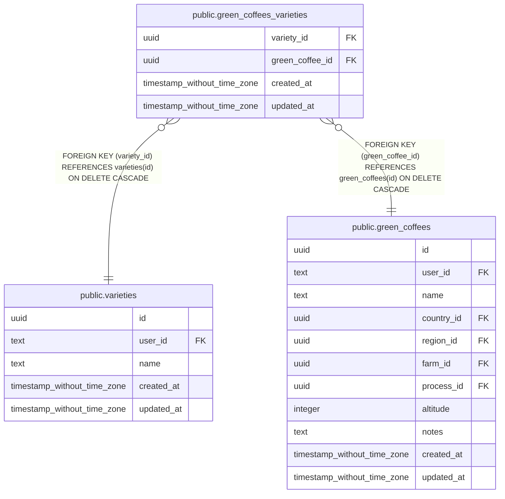

# public.green_coffees_varieties

## Columns

| Name | Type | Default | Nullable | Children | Parents | Comment |
| ---- | ---- | ------- | -------- | -------- | ------- | ------- |
| variety_id | uuid |  | false |  | [public.varieties](public.varieties.md) |  |
| green_coffee_id | uuid |  | false |  | [public.green_coffees](public.green_coffees.md) |  |
| created_at | timestamp without time zone | now() | false |  |  |  |
| updated_at | timestamp without time zone |  | true |  |  |  |

## Constraints

| Name | Type | Definition |
| ---- | ---- | ---------- |
| green_coffees_varieties_green_coffee_id_green_coffees_id_fkey | FOREIGN KEY | FOREIGN KEY (green_coffee_id) REFERENCES green_coffees(id) ON DELETE CASCADE |
| green_coffees_varieties_pkey | PRIMARY KEY | PRIMARY KEY (green_coffee_id, variety_id) |
| green_coffees_varieties_variety_id_varieties_id_fkey | FOREIGN KEY | FOREIGN KEY (variety_id) REFERENCES varieties(id) ON DELETE CASCADE |

## Indexes

| Name | Definition |
| ---- | ---------- |
| green_coffees_varieties_pkey | CREATE UNIQUE INDEX green_coffees_varieties_pkey ON public.green_coffees_varieties USING btree (green_coffee_id, variety_id) |

## Relations

---

> Generated by [tbls](https://github.com/k1LoW/tbls)
