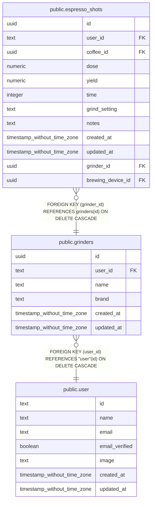

# public.grinders

## Columns

| Name | Type | Default | Nullable | Children | Parents | Comment |
| ---- | ---- | ------- | -------- | -------- | ------- | ------- |
| id | uuid | gen_random_uuid() | false | [public.espresso_shots](public.espresso_shots.md) |  |  |
| user_id | text |  | false |  | [public.user](public.user.md) |  |
| name | text |  | false |  |  |  |
| brand | text |  | false |  |  |  |
| created_at | timestamp without time zone | now() | false |  |  |  |
| updated_at | timestamp without time zone |  | true |  |  |  |

## Constraints

| Name | Type | Definition |
| ---- | ---- | ---------- |
| grinders_user_id_user_id_fkey | FOREIGN KEY | FOREIGN KEY (user_id) REFERENCES "user"(id) ON DELETE CASCADE |
| grinders_pkey | PRIMARY KEY | PRIMARY KEY (id) |

## Indexes

| Name | Definition |
| ---- | ---------- |
| grinders_pkey | CREATE UNIQUE INDEX grinders_pkey ON public.grinders USING btree (id) |
| grinders_user_id_index | CREATE INDEX grinders_user_id_index ON public.grinders USING btree (user_id) |
| grinders_name_user_id_index | CREATE UNIQUE INDEX grinders_name_user_id_index ON public.grinders USING btree (name, user_id) |

## Relations

---

> Generated by [tbls](https://github.com/k1LoW/tbls)
