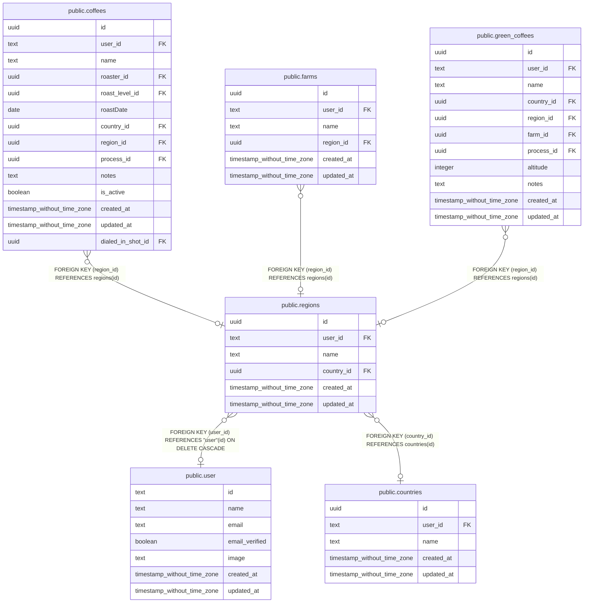

# public.regions

## Columns

| Name | Type | Default | Nullable | Children | Parents | Comment |
| ---- | ---- | ------- | -------- | -------- | ------- | ------- |
| id | uuid | gen_random_uuid() | false | [public.coffees](public.coffees.md) [public.farms](public.farms.md) [public.green_coffees](public.green_coffees.md) |  |  |
| user_id | text |  | true |  | [public.user](public.user.md) |  |
| name | text |  | false |  |  |  |
| country_id | uuid |  | true |  | [public.countries](public.countries.md) |  |
| created_at | timestamp without time zone | now() | false |  |  |  |
| updated_at | timestamp without time zone |  | true |  |  |  |

## Constraints

| Name | Type | Definition |
| ---- | ---- | ---------- |
| regions_country_id_countries_id_fkey | FOREIGN KEY | FOREIGN KEY (country_id) REFERENCES countries(id) |
| regions_pkey | PRIMARY KEY | PRIMARY KEY (id) |
| regions_user_id_user_id_fkey | FOREIGN KEY | FOREIGN KEY (user_id) REFERENCES "user"(id) ON DELETE CASCADE |

## Indexes

| Name | Definition |
| ---- | ---------- |
| regions_pkey | CREATE UNIQUE INDEX regions_pkey ON public.regions USING btree (id) |
| regions_name_country_idx | CREATE UNIQUE INDEX regions_name_country_idx ON public.regions USING btree (name, country_id) |

## Relations

---

> Generated by [tbls](https://github.com/k1LoW/tbls)
