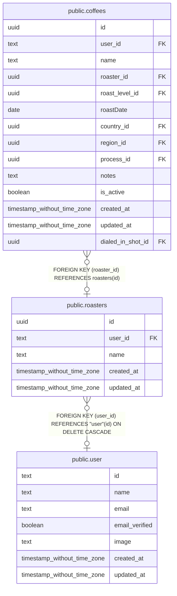

# public.roasters

## Columns

| Name | Type | Default | Nullable | Children | Parents | Comment |
| ---- | ---- | ------- | -------- | -------- | ------- | ------- |
| id | uuid | gen_random_uuid() | false | [public.coffees](public.coffees.md) |  |  |
| user_id | text |  | true |  | [public.user](public.user.md) |  |
| name | text |  | false |  |  |  |
| created_at | timestamp without time zone | now() | false |  |  |  |
| updated_at | timestamp without time zone |  | true |  |  |  |

## Constraints

| Name | Type | Definition |
| ---- | ---- | ---------- |
| roasters_pkey | PRIMARY KEY | PRIMARY KEY (id) |
| roasters_user_id_user_id_fkey | FOREIGN KEY | FOREIGN KEY (user_id) REFERENCES "user"(id) ON DELETE CASCADE |

## Indexes

| Name | Definition |
| ---- | ---------- |
| roasters_pkey | CREATE UNIQUE INDEX roasters_pkey ON public.roasters USING btree (id) |
| roasters_name_idx | CREATE UNIQUE INDEX roasters_name_idx ON public.roasters USING btree (name) |

## Relations

---

> Generated by [tbls](https://github.com/k1LoW/tbls)
