# public.user

## Columns

| Name | Type | Default | Nullable | Children | Parents | Comment |
| ---- | ---- | ------- | -------- | -------- | ------- | ------- |
| id | text |  | false | [public.coffee_processes](public.coffee_processes.md) [public.coffees](public.coffees.md) [public.countries](public.countries.md) [public.espresso_shots](public.espresso_shots.md) [public.farms](public.farms.md) [public.green_coffees](public.green_coffees.md) [public.regions](public.regions.md) [public.roast_levels](public.roast_levels.md) [public.roasters](public.roasters.md) [public.varieties](public.varieties.md) [public.account](public.account.md) [public.session](public.session.md) |  |  |
| name | text |  | false |  |  |  |
| email | text |  | false |  |  |  |
| email_verified | boolean | false | false |  |  |  |
| image | text |  | true |  |  |  |
| created_at | timestamp without time zone | now() | false |  |  |  |
| updated_at | timestamp without time zone | now() | false |  |  |  |

## Constraints

| Name | Type | Definition |
| ---- | ---- | ---------- |
| user_pkey | PRIMARY KEY | PRIMARY KEY (id) |
| user_email_key | UNIQUE | UNIQUE (email) |

## Indexes

| Name | Definition |
| ---- | ---------- |
| user_pkey | CREATE UNIQUE INDEX user_pkey ON public."user" USING btree (id) |
| user_email_key | CREATE UNIQUE INDEX user_email_key ON public."user" USING btree (email) |

## Relations

```mermaid
erDiagram

"public.coffee_processes" }o--o| "public.user" : "FOREIGN KEY (user_id) REFERENCES #quot;user#quot;(id) ON DELETE CASCADE"
"public.coffees" }o--|| "public.user" : "FOREIGN KEY (user_id) REFERENCES #quot;user#quot;(id) ON DELETE CASCADE"
"public.countries" }o--o| "public.user" : "FOREIGN KEY (user_id) REFERENCES #quot;user#quot;(id) ON DELETE CASCADE"
"public.espresso_shots" }o--|| "public.user" : "FOREIGN KEY (user_id) REFERENCES #quot;user#quot;(id) ON DELETE CASCADE"
"public.farms" }o--o| "public.user" : "FOREIGN KEY (user_id) REFERENCES #quot;user#quot;(id) ON DELETE CASCADE"
"public.green_coffees" }o--|| "public.user" : "FOREIGN KEY (user_id) REFERENCES #quot;user#quot;(id) ON DELETE CASCADE"
"public.regions" }o--o| "public.user" : "FOREIGN KEY (user_id) REFERENCES #quot;user#quot;(id) ON DELETE CASCADE"
"public.roast_levels" }o--o| "public.user" : "FOREIGN KEY (user_id) REFERENCES #quot;user#quot;(id) ON DELETE CASCADE"
"public.roasters" }o--o| "public.user" : "FOREIGN KEY (user_id) REFERENCES #quot;user#quot;(id) ON DELETE CASCADE"
"public.varieties" }o--o| "public.user" : "FOREIGN KEY (user_id) REFERENCES #quot;user#quot;(id) ON DELETE CASCADE"
"public.account" }o--|| "public.user" : "FOREIGN KEY (user_id) REFERENCES #quot;user#quot;(id) ON DELETE CASCADE"
"public.session" }o--|| "public.user" : "FOREIGN KEY (user_id) REFERENCES #quot;user#quot;(id) ON DELETE CASCADE"

"public.user" {
  text id
  text name
  text email
  boolean email_verified
  text image
  timestamp_without_time_zone created_at
  timestamp_without_time_zone updated_at
}
"public.coffee_processes" {
  uuid id
  text user_id FK
  text name
  timestamp_without_time_zone created_at
  timestamp_without_time_zone updated_at
}
"public.coffees" {
  uuid id
  text user_id FK
  text name
  uuid roaster_id FK
  uuid roast_level_id FK
  date roastDate
  uuid country_id FK
  uuid region_id FK
  uuid process_id FK
  text notes
  boolean is_active
  timestamp_without_time_zone created_at
  timestamp_without_time_zone updated_at
  uuid dialed_in_shot_id FK
}
"public.countries" {
  uuid id
  text user_id FK
  text name
  timestamp_without_time_zone created_at
  timestamp_without_time_zone updated_at
}
"public.espresso_shots" {
  uuid id
  text user_id FK
  uuid coffee_id FK
  numeric dose
  numeric yield
  integer time
  text grind_setting
  text notes
  timestamp_without_time_zone created_at
  timestamp_without_time_zone updated_at
}
"public.farms" {
  uuid id
  text user_id FK
  text name
  uuid region_id FK
  timestamp_without_time_zone created_at
  timestamp_without_time_zone updated_at
}
"public.green_coffees" {
  uuid id
  text user_id FK
  text name
  uuid country_id FK
  uuid region_id FK
  uuid farm_id FK
  uuid process_id FK
  integer altitude
  text notes
  timestamp_without_time_zone created_at
  timestamp_without_time_zone updated_at
}
"public.regions" {
  uuid id
  text user_id FK
  text name
  uuid country_id FK
  timestamp_without_time_zone created_at
  timestamp_without_time_zone updated_at
}
"public.roast_levels" {
  uuid id
  text user_id FK
  text name
  timestamp_without_time_zone created_at
  timestamp_without_time_zone updated_at
}
"public.roasters" {
  uuid id
  text user_id FK
  text name
  timestamp_without_time_zone created_at
  timestamp_without_time_zone updated_at
}
"public.varieties" {
  uuid id
  text user_id FK
  text name
  timestamp_without_time_zone created_at
  timestamp_without_time_zone updated_at
}
"public.account" {
  text id
  text account_id
  text provider_id
  text user_id FK
  text access_token
  text refresh_token
  text id_token
  timestamp_without_time_zone access_token_expires_at
  timestamp_without_time_zone refresh_token_expires_at
  text scope
  text password
  timestamp_without_time_zone created_at
  timestamp_without_time_zone updated_at
}
"public.session" {
  text id
  timestamp_without_time_zone expires_at
  text token
  timestamp_without_time_zone created_at
  timestamp_without_time_zone updated_at
  text ip_address
  text user_agent
  text user_id FK
}
```

---

> Generated by [tbls](https://github.com/k1LoW/tbls)
